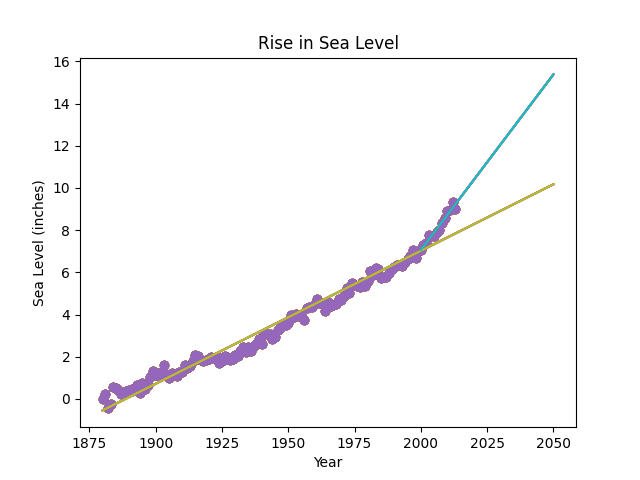

# Sea Level Predictor

A data analysis project that predicts sea level rise through 2050 using historical data.

# Project Overview

This project uses Python to:

- Read sea level data with Pandas
- Create a scatter plot with Matplotlib
- Calculate linear regression models with SciPy
- Predict sea level rise through 2050
- Compare the long-term trend with the trend since 2000

# Technologies

- Python
- Pandas
- NumPy
- SciPy
- Matplotlib

# Result

# Run the Project

This is the boilerplate for the Sea Level Predictor project. Instructions for building your project can be found at https://www.freecodecamp.org/learn/data-analysis-with-python/data-analysis-with-python-projects/sea-level-predictor
